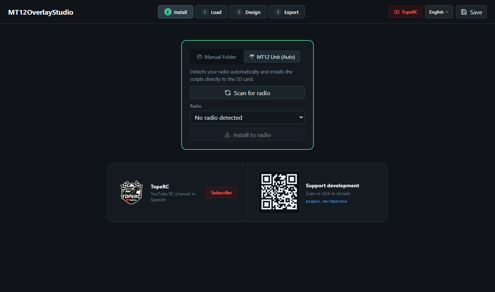
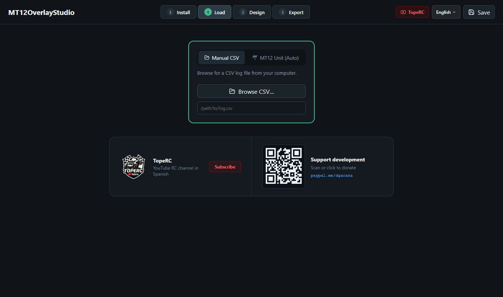
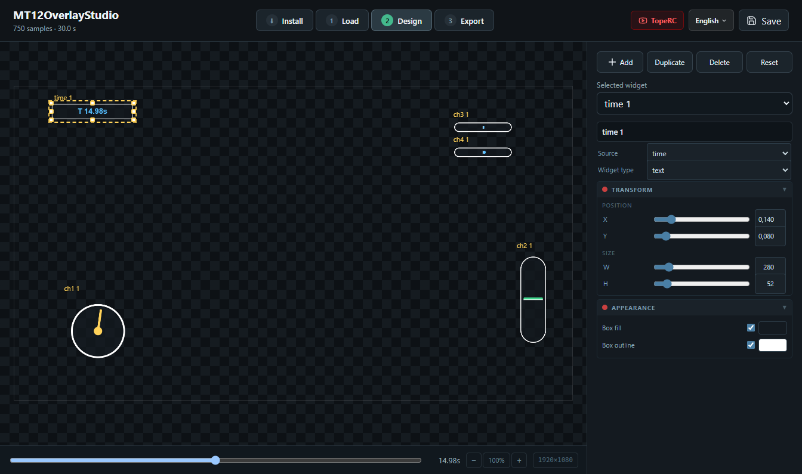
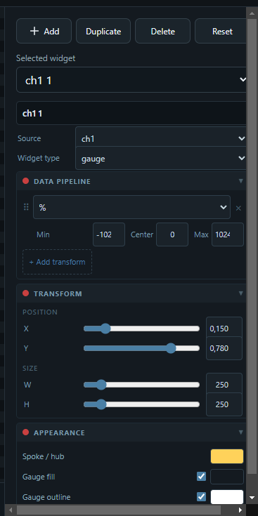
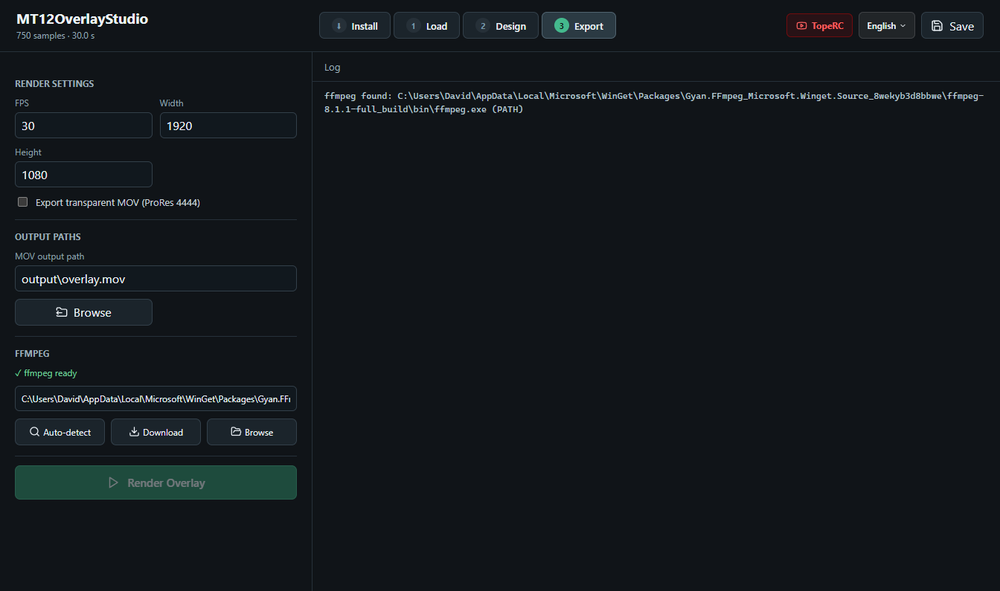

<div align="center">
  
  <h1>MT12OverlayStudio</h1>
  <p>Frame-accurate transparent video overlays from RadioMaster MT12 telemetry logs.</p>
  <p>
    <a href="https://github.com/toperc/MT12OverlayStudio/releases/latest">Download</a> ·
    <a href="https://www.youtube.com/@TopeRC-es">TopeRC on YouTube</a>
  </p>
  <p>
    
    
    
    
    
  </p>
</div>

---

## Table of contents

- [What it does](#what-it-does)
- [Install the app](#install-the-app)
- [Lua logger scripts](#lua-logger-scripts)
- [Internationalisation](#internationalisation)
- [Development](#development)
- [Distribution](#distribution)
- [Architecture notes](#architecture-notes)

---

## What it does

The workflow has three steps, mirrored in the app's tab navigation:

### Install
Set up the Lua logger scripts on the radio's SD card — either by pointing to a folder manually or by connecting the MT12 via USB and letting the app detect it automatically.



### Load
Load a telemetry CSV from your radio.



- **Manual CSV** — browse to any `.csv` file or paste a path directly
- **MT12 Unit (Auto)** — scans connected drives for an EdgeTX SD card, lists available log files by model and date

### Design
Visual overlay editor. Drag widgets onto a live preview of your frame, resize them, and style every color.



- **Widget types** — `gauge` (rotating spoke), `vertical_bar` (throttle/brake), `bar` (horizontal channel), `text` (value label or timer)
- **Sources** — `time` (session clock) plus any channel present in the CSV (`ch1`, `ch2`, … `chN`)
- **Preview timeline** — scrub through the session to see live animated widget values
- **Zoom & pan** — mouse wheel to zoom, drag the background to pan; zoom controls in the timeline bar
- **Inspector** — name, label, position (X/Y as frame fractions), pixel size, shadow toggle, and per-widget color controls
- **Per-widget transforms** — `min`, `max`, `avg` (running session stats) and `%` (map to a custom range) can be chained per widget in the **Data Pipeline** section of the inspector

#### Data Pipeline

Raw CSV values (typically `−1024..1024`) can be transformed before the widget renders them. Transforms are applied in order and can be chained.

| Transform | Effect |
|-----------|--------|
| `min` | Replace current value with the session minimum up to this frame |
| `max` | Replace current value with the session maximum up to this frame |
| `avg` | Replace current value with the running average up to this frame |
| `%` | Map the raw value to `−100..100` using a custom Min / Center / Max range |

**Example — steering angle as percentage:**  
A raw `ch1` value of `−1024..1024` becomes `−100%..100%` by adding a `%` transform with Min `−1024`, Center `0`, Max `1024`. The gauge then shows the full steering travel as a normalised arc.



### Export
Render the overlay to a transparent ProRes 4444 MOV using ffmpeg, or to a PNG frame sequence.



- Configure FPS, output resolution (width × height), and output paths
- Progress bar with frame counter during rendering
- ffmpeg auto-detect (PATH search), auto-download, or manual path selection
- MOV output is transparency-ready for compositing in DaVinci Resolve, Premiere, Final Cut, etc.

---

## Install the app

Go to the [Releases page](https://github.com/toperc/MT12OverlayStudio/releases/latest) and download the installer for your platform:

| Platform | File |
|----------|------|
| Windows  | `MT12OverlayStudio-x.x.x-setup.exe` |
| macOS (Apple Silicon) | `MT12OverlayStudio-x.x.x-arm64.dmg` |
| macOS (Intel) | `MT12OverlayStudio-x.x.x-x64.dmg` |
| Linux | `MT12OverlayStudio-x.x.x.AppImage` or `.deb` |

The app checks for updates automatically on startup and prompts you to install them.

---

## Lua logger scripts

The `edgetx/sdcard/SCRIPTS/` folder contains the Lua scripts that run on the radio and write CSV data to the SD card.

```
SCRIPTS/
├── RCLOG/
│   └── RCLOGC.lua        ← shared core module
├── TELEMETRY/
│   └── RCLOG.lua         ← runs in background while the model is active (recommended)
└── TOOLS/
    └── RCLOG.lua         ← launch manually from SYSTEM > TOOLS
```

### Automatic installation

Connect the MT12 via USB, open the **Install** tab, select the radio unit, and click **Install to radio**. The app copies the three files to the correct locations automatically.

### Manual installation

1. Connect the MT12 via USB and open the SD card (e.g. `E:\`).
2. Copy the files from `edgetx/sdcard/SCRIPTS/` to the matching folders on the SD card:

   | File in repo | Destination on SD card |
   |---|---|
   | `RCLOG/RCLOGC.lua` | `SCRIPTS/RCLOG/RCLOGC.lua` |
   | `TELEMETRY/RCLOG.lua` | `SCRIPTS/TELEMETRY/RCLOG.lua` |
   | `TOOLS/RCLOG.lua` | `SCRIPTS/TOOLS/RCLOG.lua` |

3. On the radio, go to **MODEL > Telemetry** and add a new telemetry script pointing to `RCLOG`.

### CSV format

The Lua script auto-discovers all available sources (inputs, channels, switches, telemetry sensors) and writes them as columns. Values are raw — no normalization is applied on the radio.

```csv
timestamp,input1,input2,ch1,ch2,ch3,ch4,sa,tx-voltage,timer1
1000,55,12,12,55,0,100,-1024,8.3,0
1004,58,10,10,58,0,100,-1024,8.3,4
```

- `timestamp` — `getTime()` ticks (10 ms each); the app converts to `time_ms` by subtracting the first tick
- Analog sources — raw EdgeTX values, typically `−1024..1024`
- Switches — `−1024`, `0`, or `1024`

A sample session for testing is included at [`docs/example_session.csv`](docs/example_session.csv).

For a detailed description of the logger design see [edgetx-rc-telemetry-logger.md](edgetx-rc-telemetry-logger.md).

---

## Internationalisation

The UI is available in four languages selectable at runtime from the topbar:

| Code | Language |
|------|----------|
| `en` | English |
| `es` | Español |
| `de` | Deutsch |
| `fr` | Français |

The selected language persists in `localStorage`. Translation files live in `src/renderer/locales/{lang}/translation.json`.

---

## Development

### Prerequisites

- Node.js ≥ 18
- npm ≥ 9
- ffmpeg on PATH (optional — the app can download it automatically)

### Install

```powershell
npm install
```

### Run

| Command | Description |
|---------|-------------|
| `npm start` | Full build → open Electron from dist files |
| `npm run start:dev` | Vite dev server + Electron with hot reload |
| `npm run build` | TypeScript + Vite production build |
| `npm run typecheck` | Type-check renderer and main process without building |
| `npm run smoke` | Non-interactive smoke test (build + quick IPC check) |
| `npm run screenshots` | Build and capture `docs/screenshots/*.png` using `docs/example_session.csv` |
| `npm run gen:example-csv` | Regenerate `docs/example_session.csv` from `scripts/gen_example_csv.js` |

`start:dev` is the fastest iteration loop — Vite handles the renderer with HMR while the main process is rebuilt on demand.

To capture screenshots with a different CSV:

```powershell
$env:MT12_SCREENSHOT_CSV = "path\to\session.csv"
npm run screenshots
```

### Project layout

```
src/
├── renderer/             # React UI (single App.tsx + styles)
│   ├── App.tsx           # All UI logic and state
│   ├── styles.css        # Dark theme styles
│   ├── i18n.ts           # i18next initialisation + language persistence
│   └── locales/          # Translation JSON files
├── main/
│   ├── main.ts           # Electron window, IPC routing, file dialogs
│   ├── nativeApi.ts      # Backend logic: CSV parsing, rendering, radio discovery
│   ├── frameRenderer.ts  # @napi-rs/canvas wrapper
│   ├── screenshots.ts    # Headless screenshot capture (MT12_SCREENSHOT=1)
│   └── updater.ts        # electron-updater (GitHub Releases)
├── preload/
│   └── preload.ts        # contextBridge — overlayApi + updaterApi to renderer
└── shared/
    ├── types.ts          # TypeScript interfaces shared across processes
    └── widgetDraw.ts     # Widget rendering — shared by renderer preview and export
scripts/
└── gen_example_csv.js    # Generates docs/example_session.csv
docs/
├── example_session.csv   # 30-second demo session for screenshots and testing
└── screenshots/          # Generated by npm run screenshots
edgetx/
└── sdcard/SCRIPTS/       # Lua logger scripts for the RadioMaster MT12
```

---

## Distribution

```powershell
npm run dist:win      # Windows NSIS installer
npm run dist:mac      # macOS DMG (arm64 + x64)
npm run dist:linux    # Linux AppImage + deb
```

Output goes to `release/`. Auto-updates are published via GitHub Releases (`toperc/MT12OverlayStudio`). The bundled Lua scripts are included as extra resources so **Install to radio** works without internet access.

---

## Architecture notes

### IPC bridge

The renderer calls `window.overlayApi.*` methods (defined in `preload.ts`). Each call becomes `ipcRenderer.invoke("native:request", command, payload)` routed to `handleNativeCommand()` in `nativeApi.ts`. Long-running operations (render, ffmpeg download) stream progress back via `emit()` → `ipcMain.send("native:event")` → the `onBridgeEvent` callback in the renderer.

### Frame rendering

All widget drawing logic lives in `src/shared/widgetDraw.ts` and works with any Canvas 2D context. The renderer uses it directly on a browser canvas for the live preview; the main process uses it via `@napi-rs/canvas` for export. Both paths produce identical output.

### Settings persistence

Settings (layout, colors, paths, ffmpeg path) are saved to `overlay_ui_settings.json` in the app data directory:

| Platform | Path |
|----------|------|
| Windows  | `%LOCALAPPDATA%\MT12OverlayStudio\` |
| macOS    | `~/Library/Application Support/MT12OverlayStudio/` |
| Linux    | `~/.config/MT12OverlayStudio/` |

---

<div align="center">
  <strong>TopeRC</strong> · RC crawling and trail driving content in Spanish<br>
  <a href="https://www.youtube.com/@TopeRC-es">youtube.com/@TopeRC-es</a>
</div>
